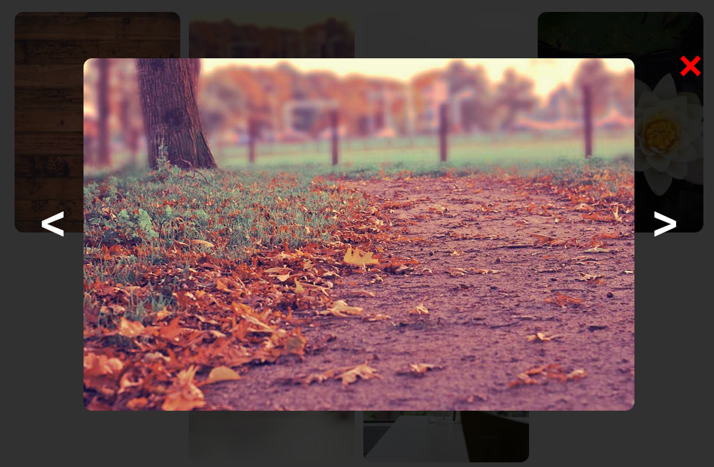

## How to use
### 1. Import component

```bash
import LightboxImage from './[your file path]';
```
### 2. Use component
the data must have id, image, bigImg, and alt

```bash
<LightboxImage images={[your data]};
```
# Preview



