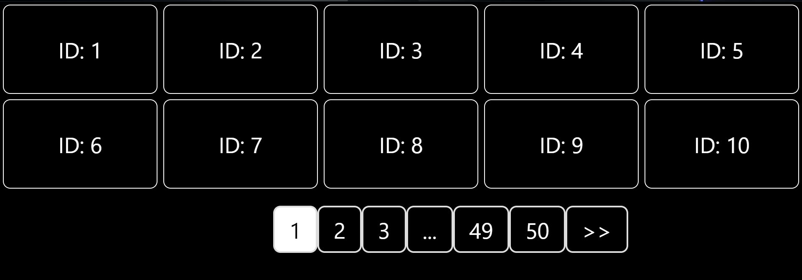

# How to use

### 1. Install React-Paginate

#### npm

```bash
npm install react-paginate --save
```

#### yarn

```bash
yarn add react-paginate
```

### 2. Use your API

in this component i use API from :

```bash
https://jsonplaceholder.typicode.com
```

you can replace it with your API

### Preview


