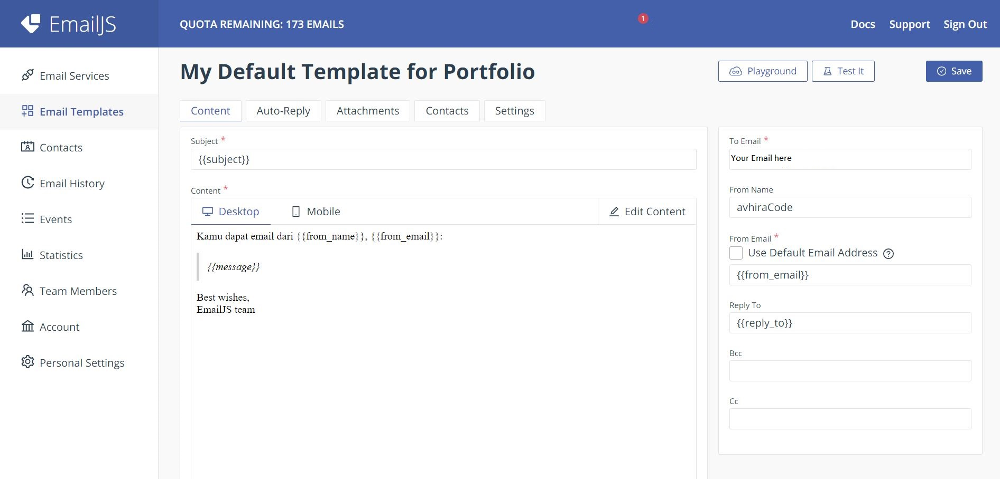
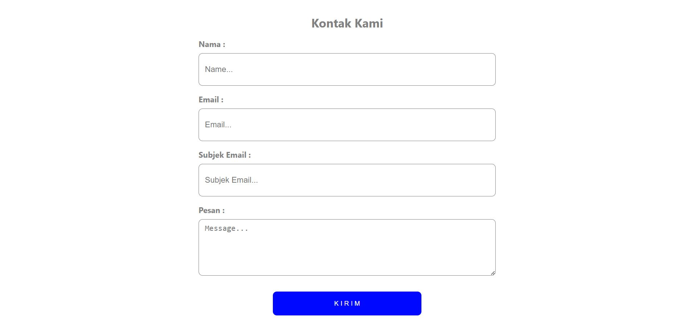

# How to use

### 1. Install Package

#### - React Toastify and Emailjs

```bash
yarn add react-toastify @emailjs/browser
```

### 2. Create Template in Emailjs



### 3. Change this code with your emailjs data

```bash
const EMAILJS_API_KEY = Your EMAILJS API KEY ID;
const EMAILJS_SERVICE_ID = Your EMAILJS SERVICE ID;
const EMAILJS_TEMPLATE_ID = Your EMAILJS TEMPLATE ID;
```

## Preview




